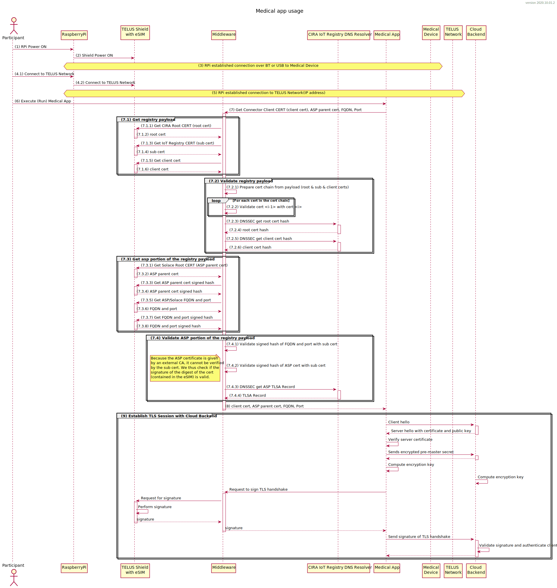

# Middleware Application for IoT Device

The purpose of the following document is to cover how the middleware for IoT was designed as well as providing the necessary tools  for future development. There are three folders containing source code, one for each language used in this application, namely C++, Python and Golang. After providing the usual "get started" and "prerequisites" sections, the rest of this document will provide the rationale for using the three languages and how the code is structured.

## Overview of Project

The main purpose of this project is to offer a proof of concept of how IoT devices can be integrated securely and registered with Cira. In particular, the middleware's role is to provide a simple API for applications to establish a two-way authenticated TLS session with an MQTT broker. To fulfill this role, we must interact with the SIM card through the modem to obtain certificates loaded on the SIM card, as well as to perform signatures. The main use case for the middleware is shown in the sequence diagram below between steps 7 and 9. Note however, that step 9 is handled mostly by Golang's crypto/tls library, but the callbacks to get the signature were written as part of this project.



## Prerequisites

### Software

You will need a C++ compiler, Python 3 installed and Golang (at least version 1.14). It is preferable to have a Linux environment. The code was solely tested on a Ubuntu 20.04 machine, but should work also on similar versions of Linux. This is an example of how these tools can be installed:


```bash
sudo apt update
sudo apt upgrade
sudo apt install build-essential # Should cover C++ compiler

# Installing openssl, getdns and other C++ dependencies
sudo apt install libssl-dev
sudo apt install libcpputest-dev
sudo apt install libgetdns-dev
sudo apt install libatlas-base-dev # Used by the Python numby package

# This may not be necessary as python3 may already be installed (it was on my RaspberryPi, as /usr/bin/python3.7)
sudo apt install python3

# Now, make python3 the default Python on my system...
sudo update-alternatives --install /usr/bin/python python /usr/bin/python2.7 1
# Note - if you've installed a different version of python3 (say, 3.8), you will 
# need to adjust the /usr/bin/python3.7 arg in the line below to be correct for your system
sudo update-alternatives --install /usr/bin/python python /usr/bin/python3.7 2
# Or possibly for Python3.8
# sudo update-alternatives --install /usr/bin/python python /usr/bin/python3.8 2

# Confirm that we are now using Python3
python --version
# You should see 
# Python 3.7.3

# To switch between python versions, you can use this command (but you shouldn't need to):
# sudo update-alternatives --config python

# Installing all other Python3 dependencies (you might already have some of them)
pip3 install ecdsa
pip3 install numpy
pip3 install pyOpenSSL
pip3 install getdns


# Installing cmake (example for 3.18.2)
wget https://github.com/Kitware/CMake/releases/download/v3.18.2/cmake-3.18.2.tar.gz
tar -zxvf cmake-3.18.2.tar.gz
cd cmake-3.18.2
# On a RaspberryPi, this next step takes quite a while...
./boostrap
# This step will also take a while (an even longer while)...
make
sudo make install


# For Golang, you need version 1.14 at least ("apt get install golang" on Ubuntu will install 1.13)

# On a RaspberryPi (ARM-based), you will need this package
wget https://golang.org/dl/go1.15.2.linux-armv6l.tar.gz
# Or, for Ubuntu, use this:
# wget https://golang.org/dl/go1.15.2.linux-amd64.tar.gz

// Put the go package files in the proper place:
sudo tar -C /usr/local -xzf go1.15.2.linux-armv6l.tar.gz
# Or, on Ubuntu, do this:
# sudo tar -C /usr/local -xzf go1.15.2.linux-amd64.tar.gz


# Add the path to the Go executables to your path and save it in your .bashrc
echo "export PATH=""$""PATH:/usr/local/go/bin" >> ~/.bashrc
source ~/.bashrc
```


Tested with the following settings:

```bash
$ python3 --version
Python 3.7.3
$ cmake --version
cmake version 3.18.2
$ go version
go version go1.15 linux/amd64
$ uname -a
Linux rp17 5.4.0-48-generic #52-Ubuntu SMP Thu Sep 10 10:58:49 UTC 2020 x86_64 x86_64 x86_64 GNU/Linux
```

### Hardware

You will need an IoT device, a Modem, an antenna and a provisioned SIM card. Note that a personal laptop can also work as an IoT device for the purpose of this project.

- Modem: Cinterion EXS82-W Revision 01.000 from Thales or Quectel-BG96
- Antenna: Wideband SMA B2 (700-2800 MHz) (Vivaldi antenna).
- IoT device: RaspberryPi 4 (Linux raspberrypi 5.4.51-v7l+ #1333 SMP Mon Aug 10 16:51:40 BST 2020 armv7l GNU/Linux)


## Get started

A few bash scripts were written to facilitate development. The `build.sh` script builds the C++ and the Golang code, the `setenv.sh` sets some environment variables to access the various executables, the `test.sh` script tests the Python middleware front and the `run.sh` script runs a basic demo.

Once the prerequisites are installed, do the following:

```bash

# Clone this repo.
git clone https://github.com/CIRALabs/iot-safe-middleware
cd iot-safe-middleware

# Now, do the build of this repo.
./build.sh
. setenv.sh
./test.sh
./run.sh
```


You'll notice that the "run.sh" script never finishes. This is because it opens up an MQTT connection and simply listens. To perform the demo, log on Solace's server and publish messages on the topic "try-me". The output should be printed on the terminal. Once you are satisfied and want to stop the demo, press Ctrl+C. Below is a more detailed explanation of the various scripts

### build.sh

The build script starts off by building the C++ code for this application. The result of this portion is the creation of a shared library that contains all the C++ code. Then, the script builds the Golang application, which results in a binary located in `Buil/tlsdemo`. Note that the entire "Build" directory is generated automatically when calling the "build.sh" script and it will contain all of the outputs of the build process.

### setenv.sh

This script should be sourced and not run (`. setenv.sh` and not `./setenv.sh`). It adds the Python and Golang executable to the PATH environment variable and also sets the "BUILD_DIR" variable. This is useful for locating the executables since there are three sources of code. Source this file after running the build.sh script. Note that you should have to source this file only once, whenever you open a new terminal.

### test.sh

It is of course not mandatory to run this script, but it provides a few unit tests of some functions in the Python middleware

### run.sh

After building the code and setting the environment, you must now run the code. This is the expected output:

```html
$ ./run.sh
2020/10/06 17:53:37 17:53 initConfig ▶ DEBU 001 Completed initialization of config
2020/10/06 17:53:37 17:53 PrepareTlsConfig ▶ DEBU 002 Preparing TLS configuration
2020/10/06 17:53:37 17:53 MW_GetAllInfo ▶ INFO 003 Retrieving information from SIM card
2020/10/06 17:53:37 17:53 runCommandGetOutput ▶ DEBU 004 Command: iot_mw.py  isProvisioned
2020/10/06 17:53:40 17:53 runCommandGetOutput ▶ DEBU 005 Command: iot_mw.py  getAllInfo
2020/10/06 17:53:49 17:53 hdlDemo ▶ INFO 006 Attempting connection at ssl://mr16sfihw41pmh.messaging.solace.cloud:8883
2020/10/06 17:53:49 17:53 runCommandGetOutput ▶ DEBU 007 Command: iot_mw.py  sign --raw --tbs +NkE/uIytIV4rtGLuxYtYehTiHIY2J9s5dWOzcPLY8M=
2020/10/06 17:53:52 17:53 hdlDemo ▶ NOTI 008 Connection established!
2020/10/06 17:53:52 17:53 hdlDemo ▶ NOTI 009 Subscribed to 'try-me'
```

After that, you can log to the CIRA 01 server  from Solace and publish information on the "try-me" topic.

## Design

The purpose of this section is to provide a rationale for certain design decisions as well as to provide the organization of the code. As mentioned earlier, there are three languages that were used, namely C++, Python and Golang. C++ is called by Python, which is itself called by Golang.

- **C++:** Low-level code that sends APDUs to the SIM card and parse the responses
- **Python:** Middleware application that loads the C++ library to interact with the SIM card and perform basic cryptographic functions, such as validating the contents of the SIM card, parsing the content into PEM formatted files. A command line utility is given that should perform all the necessary middleware funcitons.
- **Golang:** To establish a two-way authenticated TLS session, Golang was the best option by far for its relative simplicity and was thus chosen for the high-level demo with MQTT. It acts as a proof of concept on how the Python code can be used to establish a two-way authenticated TLS session.

The following sections provide more details on the structure of each part of this project.

### C++

There are two main parts to the C++ code. The first part ("iot-safe-middleware") was written by Thales, although a few modifications were applied. The second part is simply a wrapper of the code that was written to facilitate integration with Python (and for that matter, with any other kind of language). The project is built using cmake and the result is a shared library that can be loaded from Python.

Here is a list of the main modifications that were made from the original `cpp/iot-safe-middleware`:

- A folder (`cpp/iot-safe-middleware/iotsafelib/general`) was added to provide common functions to both the "common" and the "platform" subdirectories. For instance, things like logs and some high level constants were added.
- Logs were added in some places within the script to control verbosity.
- Basic timeouts for commands were added to avoid crashing the modem on some commands.
- The function "ROT::readFile" was changed to prevent crashes due to null pointers and to allow the caller to control memory allocation instead of the function itself.

The rationale for creating a wrapper was mainly to have a few easy to use functions that could be called from any other language that can load a C library. Indeed, the wrappers themselves are only using C-types to facilitate the conversion. Here are the exported function prototypes:

- ```c++
  PY_ERR GetRandom( uint8_t* pu8Data, uint16_t u16dataLen, const char* pModemPort, uint8_t u8LogLevel )
  ```

- ```c++
  PY_ERR GetCertificate(
              uint32_t u32ContainerId,
              uint16_t u16BufferSize,
              uint8_t *pu8Cert,
              uint16_t *pu16CertLen,
              const char *pModemPort,
              uint8_t u8LogLevel )
  ```

- ```c++
  PY_ERR GetURLAndPort(
              uint8_t *pu8UrlAndPortString,
              uint16_t *pu16UrlAndPortLen,
              const char *pModemPort,
              uint8_t u8LogLevel )
  ```

- ```c++
  PY_ERR GenerateSignature(
              char *pu8Message,
              uint16_t u16MessageLen,
              uint8_t *pu8Signature,
              uint16_t *pu16SignatureLen,
              const char *pModemPort,
              uint8_t u8LogLevel )
  ```

  ```c++
  PY_ERR GenerateRawSignature(
              char *pu8Message,
              uint16_t u16MessageLen,
              uint8_t *pu8Signature,
              uint16_t *pu16SignatureLen,
              const char *pModemPort,
              uint8_t u8LogLevel )
  ```

### Python

Python was chosen as it is a widely used language and can increase development speed. The purpose of this code is to hide away all of the C++ code and provide a simple API for developers. The code is split in three files:

- **utils.py:**  This file loads the C++ shared library and provides an API to the functions shown previously. In addition, it contains a number of cryptographic functions such as signature verification and certificate verification, and it contains a number of functions used to parse the data into the appropriate format (e.g., PEM file)
- **demo.py:** Can be used to run unit tests on some of the main functions in utils.py. To use it, run `./demo.py`
- **iot_mw.py:** This file contains a command line API that can be used to interact with the middleware. This is ultimately the tool that should be used to interact with the middleware as it implements all of the appropriate cryptographic verifications on the material retrieved. To obtain information on how to use the command, run `iot_mw.py --help`.

### Golang

As far as the middleware is concerned, calling `iot_mw.y` should meet all the requirements. However, it is very hard to establish a two-way authenticated TLS session from Python. The main reason being that Python expects to receive the private key in a PEM encoded file. For security reasons, the private key can never be accessed and especially not stored in a file, rendering two-way authentication complicated. Since Python relies on OpenSSL for cryptography, it is technically possible to use a PKCS#11 interface, although this assumption for IoT development is not reasonable. Furthermore, it would require implementing and maintaining an OpenSSL engine and a PKCS#11 interface, which isn't trivial.

For these reasons, Golang was chosen to provide a proof of concept on how to establish MQTT over TLS. The Golang application provided has a simple command line API. For more information, run `tlsdemo help`. The main use case for this application is `tlsdemo demo`. The handler for this function can be found in `golang/src/tlsdemo/cmd/cmd_handler.go` and constitutes a complete example on how to set an MQTT connection over TLS, subscribe to a topic and receive messages. Note however that the functions in `golang/src/tlsdemo/cmd/commands.go` implement the main tools required for establishing the TLS session and should therefore not be modified. Here are some of these functions:

- **PrepareTlsConfig:** Calls `iot_mw.py` to retrieve all of the information required for the connection (URL, Port, Root certificate, client certificate). The verification of the information is performed by `iot_mw.py` and is thus not repeated here. The information is parsed to Golang's types and a TLS configuration is prepared with the appropriate information and the appropriate callbacks.
- **MW_IsProvisioned, MW_GetAllInfo:** Interface between Golang and `iot_mw.py` for two functions. that are particularly useful
- **Public and Sign:** Do not modify the interface of these two functions. They are the main reason why Golang was used in the first place. Indeed, Golang has the concept of interface, which regroups any object that meet a number of defined functions. Private keys in Golang are nothing else than an interface. Therefore a new object was created (IoTPrivateKey_t) with the two functions Public and Sign defined. This object passes as a private key from Golang's perspective. It is much easier to use this concept as we can define a callback that relies on the `iot_mw.py` application.

## Known Issues

- There is currently no way to obtain general information from the SIM card. Information such as the eID, the version of the SIM card, the model, if it was properly provisioned etc. At the moment, we try reading the client certificate and if an error is returned, we assume the SIM card was not provisioned. This is not ideal of course.

- There is no way to obtain information about the various files. Currently, only constants obtained from documentation can be used to associate files with what they represent. For instance, there is no way to know that containerID #2 contains the client certificate unless we read the documentation. This is not ideal as future updates of the SIM card will necessitate modifications in the code as well. In the same line of thought, there is no way to get the size of a file or any similar attributes.

- In some cases, the modem crashes and needs to be reset. Note that the code has obtained some stability in this regard and the C++ wrapper functions should avoid those "hanging" conditions. However, be aware of this when developing in C++

- If a signature is aborted before completion, the modem gets in a state that cannot be reset by power cycling the modem. It is not clear what causes the issue and it is therefore not clear how to solve the issue. However, to work around this issue, you can send a few AT commands directly to the modem. For example, you can use "minicom" by using the command `sudo minicom` and configure the settings to match the appropriate port. Then, write the following commands:

  ```
  AT+CSIM=10,"0070000001" # Expects: +CSIM: 6,"019000"
  AT+CSIM=24,"01A4040007A0000002480400" # Expects: +CSIM: 4,"9000"
  AT+CSIM=36,"012A00000D840101A1010391020001920104" # Expects: +CSIM: 4,"6A86"
  AT+CSIM=24,"012B9000069B040102030400" # Expects a long string
  ```

  Afterwards, the signatures should work again.

- Initially, code was written in Python to facilitate development. However, as discussed earlier, Golang was necessary to perform two-way authenticated TLS sessions. For future development, it would be interesting to migrate the Python code entirely to Golang and load the C++ library from there. This would simplify the interfacing, simplify the codebase and improve maintainability.

- There have been some issues with the QUECTEL modem not working correctly without having a firmware update applied.  The update is located here: 
https://github.com/TELUS-Emerging-IoT/Quectel-BG96-Firmware-Upgrade

- Also, the Cinterion modem might also require a firmware update to function correctly.  Watch this space for the fix to be posted soonly.
